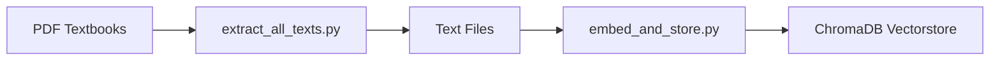
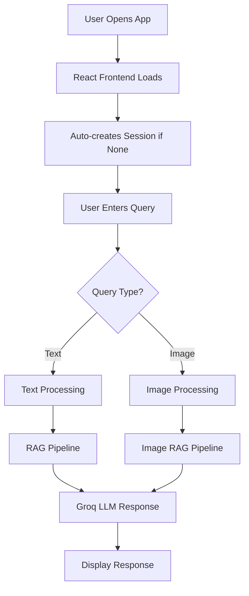
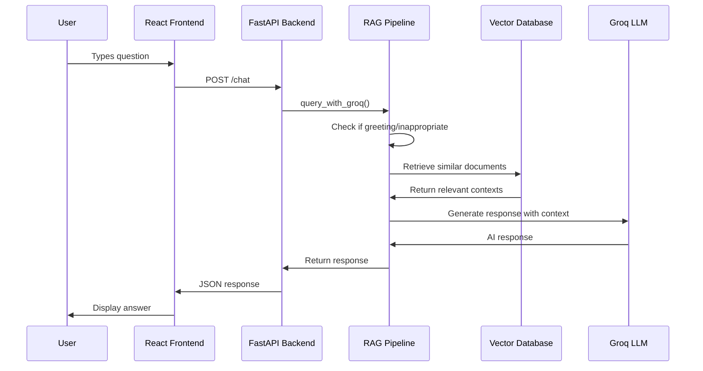
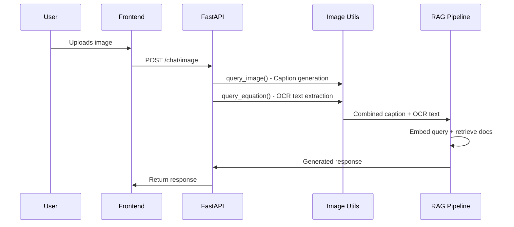

# LearnMate Architecture Overview

## 🏗️ System Architecture

LearnMate is a full-stack RAG (Retrieval-Augmented Generation) application that helps students with Math and Science questions through an AI-powered chat interface. The system combines document retrieval, language models, and image processing capabilities.

## 📁 Project Structure

```
LearnMate/
├── core/                    # Backend FastAPI application
│   ├── main.py             # FastAPI server & API endpoints
│   ├── rag_pipeline.py     # RAG processing for images
│   └── image_utils.py      # Image processing utilities
├── scripts/                # Data processing & ML scripts
│   ├── rag_query_groq_api.py # Main RAG query processing
│   ├── embed_and_store.py   # Document embedding pipeline
│   └── extract_all_texts.py # PDF text extraction
├── ui/                     # React frontend
│   ├── src/
│   │   ├── App.js          # Main React application
│   │   └── components/
│   │       ├── ChatWindow.jsx # Chat interface
│   │       └── Sidebar.jsx    # Session management
├── data/                   # Educational content
│   ├── docs/               # Processed text files
│   └── raw_pdfs/          # Original PDF textbooks
├── vectorstore/           # ChromaDB vector database
└── .env                   # API keys configuration
```

## 🔄 Code Flow & Workflows

### 1. **Data Preparation Workflow**


**Key Files:**
- `scripts/extract_all_texts.py`: Extracts text from PDF textbooks
- `scripts/embed_and_store.py`: Creates embeddings and stores in vector database
- `data/raw_pdfs/`: Source PDF files (Class 9-10 Math & Science)
- `vectorstore/`: ChromaDB storage for document embeddings

### 2. **Main Application Flow**


### 3. **Text Query Processing Flow**


### 4. **Image Processing Flow**


## 🔧 Core Components

### **1. FastAPI Backend (`core/main.py`)**
**Purpose:** REST API server handling all backend operations

**Key Endpoints:**
- `POST /chat` - Text-based queries
- `POST /chat/image` - Image upload and analysis
- `POST /session` - Create new chat session
- `GET /sessions` - List all sessions
- `GET /session/{id}` - Get session messages
- `DELETE /session/{id}` - Delete session

**Features:**
- Auto-session creation for new users
- SQLite database for chat history
- CORS enabled for frontend communication
- File upload handling for images

### **2. RAG Query Engine (`scripts/rag_query_groq_api.py`)**
**Purpose:** Core intelligence layer combining document retrieval with LLM

**Key Functions:**
- `query_with_groq()` - Main query processing
- `is_greeting_or_general()` - Detects greetings/general queries
- `get_showcase_response()` - Returns capability showcase
- `is_inappropriate()` - Content filtering
- `retrieve_relevant_docs()` - Vector similarity search
- `ask_question()` - LLM prompt generation

**Workflow:**
1. Input validation and content filtering
2. Query embedding using HuggingFace models
3. Vector similarity search in ChromaDB
4. Context preparation for LLM
5. Groq LLM response generation

### **3. React Frontend (`ui/src/`)**
**Purpose:** User interface for chat interactions

**Components:**
- **App.js**: Main application state management
- **ChatWindow.jsx**: Chat interface with message display
- **Sidebar.jsx**: Session management sidebar

**Features:**
- Real-time chat interface
- File upload (drag & drop)
- Session management
- Auto-session creation
- Loading states and error handling

### **4. Image Processing (`core/image_utils.py`)**
**Purpose:** Extract information from uploaded images

**Capabilities:**
- Image captioning using Vision Transformers
- OCR for mathematical equations
- Integration with RAG pipeline

### **5. Vector Database Setup**
**Purpose:** Efficient document retrieval

**Components:**
- ChromaDB for vector storage
- Sentence Transformers for embeddings
- Class 9-10 Math & Science content indexed

## 🔑 Key Technologies

### **Backend Stack:**
- **FastAPI**: Modern Python web framework
- **ChromaDB**: Vector database for embeddings
- **SQLite**: Chat history storage
- **HuggingFace Transformers**: Text embeddings
- **Groq**: Fast LLM inference

### **Frontend Stack:**
- **React**: UI library
- **Axios**: HTTP client
- **CSS-in-JS**: Styling

### **AI/ML Stack:**
- **Sentence Transformers**: Document embeddings
- **Vision Transformers**: Image understanding
- **OCR**: Text extraction from images
- **Groq LLaMA**: Language model

## 🚀 Deployment Flow

### **Development Setup:**
1. Install Python dependencies: `pip install -r requirements.txt`
2. Install Node.js dependencies: `cd ui && npm install`
3. Set up environment variables in `.env`
4. Process educational content: `python scripts/embed_and_store.py`
5. Start backend: `python -m uvicorn core.main:app --reload`
6. Start frontend: `cd ui && npm start`

### **Key Environment Variables:**
```bash
GROQ_API_KEY=your_groq_api_key
HF_API_TOKEN=your_huggingface_token
```

## 🎯 Interview Talking Points

### **Technical Highlights:**
1. **RAG Architecture**: Combines retrieval with generation for accurate, contextual responses
2. **Multi-modal Input**: Handles both text queries and image uploads
3. **Real-time Processing**: Efficient vector search and LLM inference
4. **Content Filtering**: Smart detection of greetings and inappropriate content
5. **Session Management**: Persistent chat history with SQLite
6. **Responsive UI**: Modern React interface with file upload

### **Scalability Considerations:**
1. **Vector Database**: ChromaDB can scale to millions of documents
2. **API Design**: RESTful endpoints ready for load balancing
3. **Stateless Backend**: Sessions stored in database, not memory
4. **Modular Architecture**: Easy to swap components (LLM, embeddings, etc.)

### **Performance Optimizations:**
1. **Groq LLM**: Fast inference for real-time responses
2. **Efficient Embeddings**: Lightweight Sentence Transformers
3. **Vector Search**: O(log n) similarity search
4. **Caching**: Browser caching for static assets

This architecture demonstrates modern AI application design, combining multiple AI models, efficient data storage, and user-friendly interfaces for educational technology.